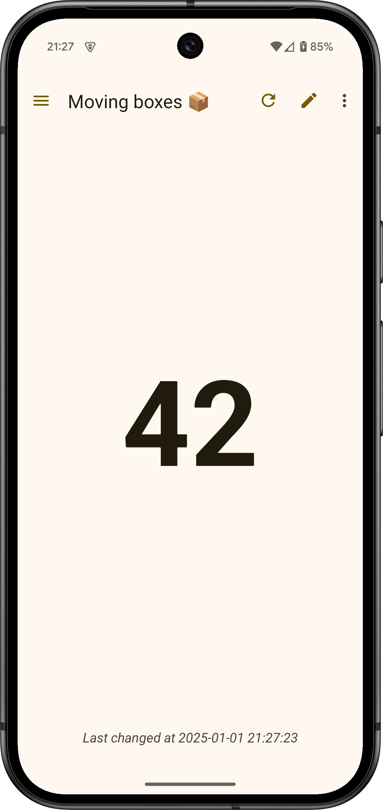
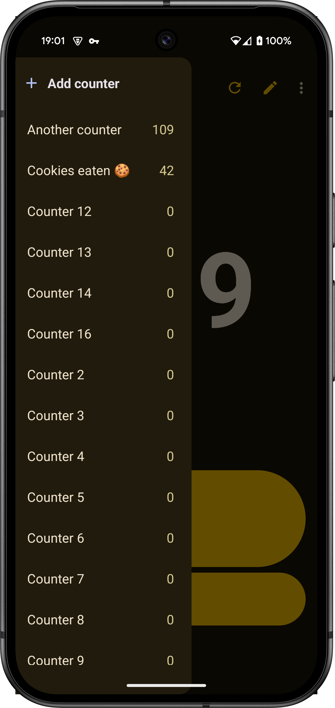
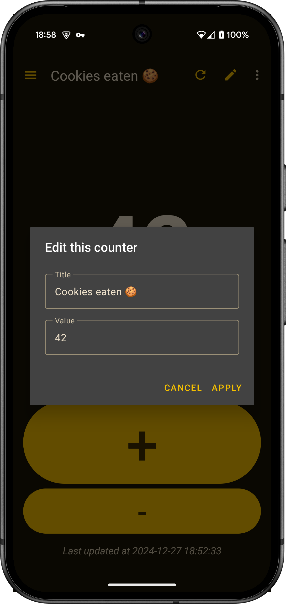

# Counter

Simple [tally counter](https://en.wikipedia.org/wiki/Tally_counter) for Android. It makes counting easier!
You can have multiple counters with their own names and values. Values can be changed using the volume buttons
or by tapping on the screen. All your data can be exported in CSV format.

---

&nbsp;&nbsp;&nbsp;&nbsp;&nbsp;&nbsp;&nbsp;&nbsp;&nbsp;&nbsp;&nbsp;&nbsp;&nbsp;&nbsp;&nbsp;&nbsp;

## Contributing

Feel free to make improvements, report issues, and create pull requests. If you want to help with
translation, go to project's [page on Crowdin](http://crowdin.net/project/simple-counter) (please,
don't translate resources directly).

## Credits

Huge thanks to all [contributors](https://github.com/gentlecat/counter/contributors)
and [translators](https://crowdin.net/project/simple-counter).

* Application icon made by @armand-leguillou
* Sounds from [adobeflash.com](https://www.adobeflash.com/download/sounds/clicks/)
